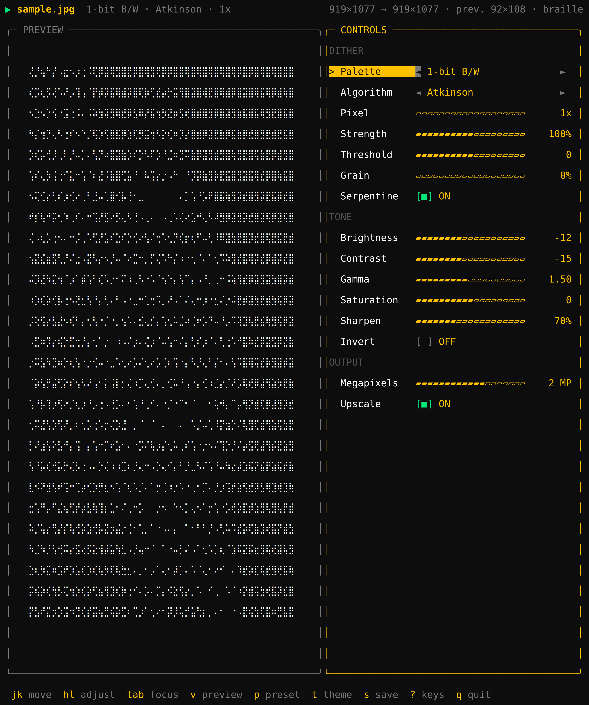
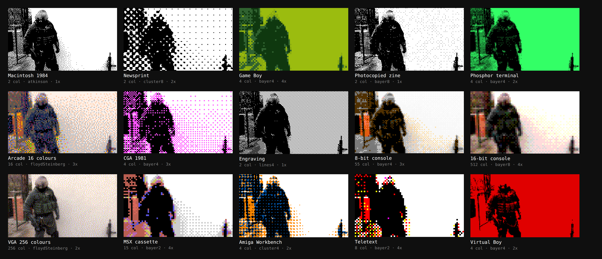

# DitherBox

Adjustable dithering for photos, with a full-screen terminal interface: boxed
panels, six-colour themes, sliders, and the preview drawn inside the terminal
itself.

Nineteen dithering algorithms and twenty-six palettes, from one-bit black and
white to the Game Boy, from the NES to the Mega Drive, from CGA and EGA to the
C64, plus any you write yourself. Tone adjustments, megapixel control over the
output, and fifteen ready-made presets. The interface speaks English, Italian,
Spanish, French and German.



## Try it in the browser

The same engine runs as a web widget, which you can try here:

> **<https://www.alessandrosimonitto.it/progetti/ditherbox>**

Everything happens on a canvas in your own browser. The photo is never
uploaded anywhere.

---

## Install

DitherBox is a Node program, so Node is the only real requirement: version 18
or newer, nothing to compile, no native modules.


### Linux

Check what you have first:

```sh
node --version    # needs v18 or newer
```

If the command is missing or the version is too old, install it from your
distribution:

```sh
# Debian, Ubuntu, Mint
sudo apt update && sudo apt install nodejs npm

# Fedora, RHEL, Rocky
sudo dnf install nodejs

# Arch, Manjaro
sudo pacman -S nodejs npm

# openSUSE
sudo zypper install nodejs npm

# Alpine
sudo apk add nodejs npm
```

Debian and Ubuntu often ship an old Node. If `node --version` still shows
something below 18, use a version manager instead, which needs no root:

```sh
curl -o- https://raw.githubusercontent.com/nvm-sh/nvm/v0.40.1/install.sh | bash
exec $SHELL
nvm install --lts
```

Then install DitherBox itself:

```sh
npm install -g github:Pricesswg/DitherBox
```

If npm complains about permissions, either point it at your home directory
once and for all:

```sh
npm config set prefix ~/.local
echo 'export PATH="$HOME/.local/bin:$PATH"' >> ~/.bashrc
exec $SHELL
```

or install from a clone instead:

```sh
git clone https://github.com/Pricesswg/DitherBox.git
cd DitherBox
npm install --omit=dev
sudo npm link
```

Check it worked:

```sh
ditherbox --version
ditherbox --help
```

To try it without installing anything at all:

```sh
npx github:Pricesswg/DitherBox ~/Pictures
```

To remove it: `npm uninstall -g ditherbox`, or `npm unlink -g ditherbox` if you
installed from a clone.

### macOS

Everything above works on macOS too, with `brew install node` in place of the
distribution package. If you would rather have Homebrew handle the whole
thing, Node included:

```sh
brew tap pricesswg/tap
brew install pricesswg/tap/ditherbox
```

The formula lives in
[`packaging/homebrew/ditherbox.rb`](packaging/homebrew/ditherbox.rb) and
`npm run release` keeps it in step with the tags: it sets the version
everywhere the program states it, builds, tests, tags, then downloads the
release tarball, writes the fingerprint into the formula and downloads it a
second time to check what it wrote. A wrong fingerprint is invisible until
somebody tries to install.

The tap itself is a public repo called `homebrew-tap` with the formula in
`Formula/`, and standing one up is a ten-minute job.

Updates work the way they do for any Homebrew package, `brew update && brew
upgrade`, but it is worth knowing where the moving part is: Homebrew watches
the tap, not this repository's tags. A new tag reaches nobody until the
formula in the tap is bumped, so `npm run release -- 0.2.0 --tag --push-tap`
does that too.
[`packaging/homebrew/README.md`](packaging/homebrew/README.md) has the exact
commands, including what to do when a proxy refuses to serve GitHub tarballs.

Plain `brew install ditherbox`, with no tap, would mean getting into
`homebrew-core`, and their rules rule this out twice over: they do not take
software that a language's own package manager already installs, and they ask
for a project with a following rather than one its author has just submitted.

### Windows

Not tested, but there is nothing platform-specific in the code. Install Node
from [nodejs.org](https://nodejs.org) and the same npm command applies. Use
Windows Terminal rather than the old console host: the preview needs 24-bit
colour and Unicode block characters.

---

## Using it

```sh
ditherbox ~/Pictures                 # browse a folder
ditherbox portrait.jpg               # open a photo directly
ditherbox photo.jpg --print          # print in the terminal and exit
```

Run it in a folder with no images and it opens the sample photo that ships
with it, so there is something to turn the knobs on straight away. Press `o`
to open your own.

The web widget on the demo page starts with the same photo already loaded.

### Keys

Arrow keys or vim keys, whichever your hands reach for first.

| Key | What it does |
|---|---|
| `↑` `↓` / `j` `k` | Scroll the parameters or the files |
| `←` `→` / `h` `l` | Adjust the selected value |
| `H` `L` / `shift+← →` | Adjust in steps of five |
| `enter` `space` | Load the file, flip the switch |
| `tab` | Move focus between controls and file list |
| `n` `N` | Next / previous image |
| `g` `G` `home` `end` | Jump to the top / bottom |
| `v` | Change preview mode |
| `1` | Preview at 1:1, no reduction |
| `tab` then `jk` `hl` | Move the 1:1 window over the file |
| `c` | Colour of the framing guide, off included |
| `t` | Pick the theme (live preview while you scroll) |
| `p` | Apply a preset |
| `ctrl+l` | Pick the language (live preview while you scroll) |
| `i` | Invert |
| `r` | Reset every parameter |
| `o` | Open a path |
| `s` / `ctrl+s` | Save at full resolution |
| `ctrl+x` | Show or hide the file list |
| `?` / `ctrl+k` | List of keys |
| `q` / `ctrl+c` | Quit |

### Saving, and where the file goes

Press `s` (or `ctrl+s`) and a text field opens, already filled in with the full
destination path: the same folder as the source photo, named
`<original>-<palette>-<algorithm>.png`. So a `portrait.jpg` dithered with the
Game Boy palette and Atkinson is suggested as:

```
/home/you/Pictures/portrait-gameboy-atkinson.png
```

That path is just text, and you edit it however you like. `~` expands to your
home directory, `ctrl+u` clears everything before the cursor, `ctrl+w` deletes
a word backwards, `esc` cancels. Only `.png` and `.jpg` are accepted, and the
extension decides the format.

The saved file is processed at **full resolution**, at whatever megapixel count
the **Megapixels** parameter is set to. The preview shows that same result,
reduced: it dithers at the export resolution and then shrinks it to the
terminal grid, which is exactly what an image viewer does when it opens the
file. So a fine dither looks smooth in the preview because it will look smooth
in the file as well. To see the texture, raise **Pixel** or lower
**Megapixels**, and it appears in both at once.

There is a limit to that, and `1` is the way past it. A preview panel has a
few thousand pixels and the file has hundreds of thousands, so fitting the
whole result into the panel averages the dots into flat tone, exactly as an
image viewer does when you shrink the file to a thumbnail. `1` stops fitting
and shows a window on the middle of the file at full resolution, one file
pixel per sub-cell, nothing resampled. It is the view that answers what the
texture will actually look like. Press it again to go back. `tab` puts the focus on the preview,
and from there the usual keys move the window over the file instead of
adjusting a parameter; the panel border lights up so you can see where the
keys are going.

In `halfblock` and `braille` the pixels are square on screen and the
proportions are true. In `quadrant` and `ascii` a cell is not square, and
those modes normally correct for it by stretching, which would mean
resampling, so at 1:1 the picture reads narrow. The megapixel cap that keeps
the interface responsive is also off at 1:1, because shrinking the image
would change the very pixels you asked to see: on a very large output,
expect a wait.

When the file has to come out at one exact size, **Width** and **Height**
take it in pixels and the megapixel slider steps aside. With **Lock ratio**
on, writing one side fills in the other from the chosen aspect, so 1920 gives
you 1080 without doing the arithmetic, and clearing one clears both back to
automatic. Unlike the megapixel budget, which is a ceiling and never enlarges,
an exact size is a request: ask for 1920 on a smaller photo and you get 1920.
One caveat, and it is arithmetic rather than a choice: at **Pixel** above 1 the
blocks are whole, so the file lands on the nearest multiple of that factor.
At Pixel 1, which is the usual case, the number you type is the number you get.

The crop is a rectangle you place yourself: **Zoom** sets how big it is,
**Offset X** and **Offset Y** where it sits. At zoom 100 the rectangle already
touches two sides and cannot move along that axis, which is why the size
control comes first: shrink it and both offsets come alive.

Whenever there is a crop to show, whether because **Aspect** asks for a ratio
the photo has not got or because **Zoom** is below 100, `c` draws a framing
guide over the preview in one of five bright colours, red by default. With
**Fit** on crop the preview goes back to showing the whole photo, dimmed
outside the guide, so you can see what you are about to lose: drawn over the
already cropped image the guide would sit exactly on the border and tell you
nothing. With **Fit** on bars the preview is framed already, and the guide
marks where the photograph ends and the bars begin. The colour is not taken
from the theme, because a guide is worth most on the images that theme suits
best, which is where a theme colour would disappear.

From the command line the destination is explicit instead:

```sh
ditherbox photo.jpg -o ~/Pictures/result.png       # one file, chosen name
ditherbox ~/Pictures/*.jpg --out-dir ./results     # in bulk, generated names
```

With `--out-dir` the names are built with the same rule as the interface, and
the folder is created if it is not there.

### The four preview modes

A terminal has no pixels, it has characters, and a cell is twice as tall as it
is wide. Each mode uses the character differently:

| Mode | Pixels per cell | When it helps |
|---|---|---|
| `halfblock` | 1x2 | **Default.** Faithful in colour and safe in any font |
| `braille` | 2x4 | The most detailed, but see the note below |
| `quadrant` | 2x2 | A middle ground, two colours per cell |
| `ascii` | 1x1 | The most nostalgic |

The default is `halfblock` and not `braille` for a practical reason: `▀` is a
block, exactly one cell wide in any font. Braille glyphs are missing from
plenty of monospaced fonts; the terminal falls back to another font with a
different advance, the columns drift apart and the frame looks broken. If your
font handles braille, press `v` and the detail more than doubles. The
screenshot at the top of this page is braille.

The preview is dithered **directly at the terminal's resolution**, not shrunk
afterwards. Dither large and then reduce, and averaging the pixels closes the
dots back into greys and the texture disappears. What you see is real
dithering, not a blurred photo.

All the space goes to the image: there is a single line at the top, the preview
panel hugs the photo instead of staying as wide as the screen, and the file
list only appears when there really is more than one image to choose from.

### The status line

Normally it reports the file, the processing chain and the sizes. While an
operation is running it becomes that operation's progress bar:

```
⠹ Processing at full resolution      ▰▰▰▰▰▰▱▱▱▱▱▱▱▱▱▱▱▱▱▱▱▱   25%   1.8s
```

The bar follows the real phases of the operation (reading, processing,
writing), not an invented countdown: while a phase is working the bar stays put
where it is. On a narrow terminal the line drops the least important
information instead of truncating the file name.

---

## Without an interface

```sh
ditherbox photo.jpg -p macintosh -o out.png
ditherbox photo.jpg --palette gameboy --scale 4 --contrast 20 -o gb.png
ditherbox photo.jpg --palette "#0a0c10,#c2fe0b" --megapixels 0.3 -o poster.png
ditherbox ~/Pictures --preset fanzine --out-dir ./results
ditherbox --list                      # palettes, algorithms, presets, themes
ditherbox --help
```

Every engine parameter has its own option: `--palette`, `--algorithm`,
`--scale`, `--strength`, `--bias`, `--noise`, `--serpentine`, `--brightness`,
`--contrast`, `--gamma`, `--saturation`, `--sharpen`, `--invert`,
`--aspect`, `--fit`, `--zoom`, `--align-x`, `--align-y`, `--width`,
`--height`, `--lock-ratio`, `--megapixels`, `--upscale`. Switches are turned off by
prefixing `--no-`.

`-l, --lang <code>` picks the language of the messages. Without it the CLI
reads `LC_ALL`, `LC_MESSAGES` and `LANG`, and falls back to English. The option
table in `--help` stays in English, because the options themselves are English,
but the parameter labels, the `--list` headings and every error message follow
the choice.

## Configuration

`~/.config/ditherbox/config.toml`:

```toml
theme = "gruvbox"
mode = "braille"
guide = "cyan"
lang = "it"
palette = "bw"
algorithm = "atkinson"
contrast = 15
megapixels = 2
```

Personal themes go in `~/.config/ditherbox/themes/*.toml`. Six colours and
nothing else:

```toml
bg = "#002b36"
accent = "#268bd2"
bright_fg = "#eee8d5"
fg = "#839496"
green = "#859900"
yellow = "#b58900"
red = "#dc322f"
```

Included themes: `simonitto` (the default), `winamp`, `gruvbox`, `dracula`,
`nord`, `catppuccin`, `tokyo-night`, `everforest`, `ember`, `matte-black`,
`hackerman`, `vantablack`, and `terminale`, which inherits your terminal's own
background.

---

## The parameters

| Parameter | Range | What it does |
|---|---|---|
| **Palette** | 26 palettes | The colours the result is allowed to use |
| **Algorithm** | 19 algorithms | How the dots get distributed |
| **Pixel** | 1 to 16 | Reduce before dithering: 1 is full detail, 8 is chunky 8-bit pixels |
| **Strength** | 0 to 200% | How much of the error (or of the ordered noise) is applied |
| **Threshold** | -100 to 100 | Moves the cut-off point: negative darkens, positive lightens |
| **Grain** | 0 to 100% | Random noise before the threshold, to break up textures that are too regular |
| **Serpentine** | on/off | Alternating scan row by row, which removes the diagonal streaks |
| **Brightness, Contrast, Gamma, Saturation** | | Tone adjustments, applied before the dithering |
| **Sharpen** | 0 to 200% | Unsharp mask, to recover the detail the dithering eats |
| **Invert** | on/off | Swaps light and dark |
| **Aspect** | 9 ratios | Frames the result: 1:1, 5:4, 4:3, 3:2, 16:10, 16:9, 21:9, 4:5, 9:16, or as the photo |
| **Fit** | crop/bars | What happens to what the ratio leaves out: cut it away, or add bars in a palette colour |
| **Zoom** | 10 to 100% | Size of the crop rectangle: 100 is the largest that fits, less zooms in |
| **Width**, **Height** | pixels | Exact size of the file; empty lets the megapixels decide |
| **Lock ratio** | on/off | Writing one side fills in the other, keeping the ratio |
| **Offset X**, **Offset Y** | 0 to 100% | Move the crop rectangle, when there is room to move it |
| **Megapixels** | 0.01 to 24 MP | Resolution of the result: lower it to ruin the photo on purpose |
| **Upscale** | on/off | Brings the result back to the original size with crisp pixels |

### Algorithms

**Error diffusion**, where each pixel's error is spread over its neighbours.
Irregular texture, very faithful tone: `floydSteinberg`,
`falseFloydSteinberg`, `atkinson`, `jarvis`, `stucki`, `burkes`, `sierra`,
`sierra2`, `sierraLite`, `stevensonArce`.

`atkinson` is the 1984 Macintosh one. It diffuses only six eighths of the
error, and that is where the marked contrast that makes it recognisable comes
from.

**Ordered matrix**, where each pixel is compared against a threshold that
depends on its position. Regular texture, old-video-game air: `bayer2`,
`bayer4`, `bayer8`, `bayer16`, `cluster4`, `cluster8` (magazine halftone),
`lines4` (engraving).

**No texture**: `none` (hard threshold) and `random` (pure noise).

### Palettes

`bw` (one bit), `gray4` `gray8` `gray16`, `gameboy`, `gameboyPocket`,
`cgaCyan`, `cgaGreen`, `pico8`, `c64`, `zx`, `greenCrt`, `amberCrt`,
`marathon`, `marathonDuo`, `marathonTerm`, `risograph`, `blueprint`,
`nes`, `ega`, `msx`, `teletext`, `amigaWb`, `virtualBoy`, `bit8`,
`megadrive`.

### Consoles and old computers

`nes` is the Famicom's master palette. The chip did not think in RGB at all,
it modulated the NTSC carrier, so every RGB version of it is somebody's
rendering; this is the common one. `msx` is the TMS9918 that MSX and
ColecoVision shared, and those three greens give it away instantly. `ega` is
IBM's sixteen, `teletext` the eight corners of the RGB cube and nothing in
between, `amigaWb` the four colours Workbench 1.3 ran its whole desktop on,
and `virtualBoy` the only screen ever built that did red and nothing else.

`bit8` and `megadrive` are not hand-picked lists. They are every colour a
given bit depth can express, which is how the hardware really worked:

| Palette | Bits per channel | Colours | Where it comes from |
|---|---|---|---|
| `bit8` | 3 red, 3 green, 2 blue | 256 | True 8-bit colour. Blue gets one bit less on purpose: the eye notices it least |
| `megadrive` | 3, 3, 3 | 512 | The Mega Drive's nine-bit colour, and the reason Sega games look a shade duller than their rivals |

For these the nearest colour is not searched for, it is calculated: on a
regular grid, rounding each channel to its closest step *is* the answer, so
there is nothing to compare against. That is what keeps a 512-colour palette
as fast as a four-colour one.

A note on what "16-bit" means, since it is asked for more often than it is
wanted: 16-bit colour proper is 65536 colours, and dithering to it produces an
image indistinguishable from the original. There is nothing to see. What people
mean by the 16-bit era is the machines, and what made those recognisable was
not the colour depth but the low resolution and the visible dither pattern.
That is what the `megadrive` preset reproduces.

`marathon` takes the colours of the 2025 game: hyper-saturated pinks and
yellows over cold steel blues and deep blacks. It is treated as a **luminance
ramp**, not as a colour palette, and that is the difference between the flat
block of colour the game actually uses and a snowfall of confetti.
`marathonDuo` keeps only black and acid yellow, for the poster cut.
`marathonTerm` is the green terminals of the 1994 Marathon.

The same goes for every tonal ramp (black and white, greys, Game Boy,
phosphor, blueprint): they are mapped on **luminance** and not on the nearest
RGB colour. It is the only way for a saturated red to land on the dark step
instead of the light green that happens to sit next to it in colour space.

### Custom palettes

A comma-separated list of hex colours works anywhere a palette name can be
written, on the command line as in `config.toml`:

```sh
ditherbox photo.jpg --palette "#0a0c10,#c2fe0b" -o poster.png
```

With only two tints the result is a duotone: the light and the dark of the
photo land on the two chosen colours, with the dithering making the midtones.

### Presets

A preset is not just a palette. It is palette, pixel size and dither texture
together, because that is what makes an era recognisable: a photo reduced to
fifty-five colours at full resolution looks washed out, not like a game.



```sh
npm run presets          # regenerate that sheet with your own photo
```

| Preset | What it is |
|---|---|
| `macintosh` | The 1984 Mac: one bit, Atkinson, no pixelation |
| `giornale` | Print halftone, clustered dots |
| `gameboy` | Four greens, chunky pixels |
| `fanzine` | High-contrast photocopy, with grain |
| `terminale` | Green phosphor terminal |
| `arcade` | PICO-8's sixteen colours |
| `cga` | CGA 1981, cyan and magenta |
| `incisione` | Engraving, diagonal lines |
| `nes` | 8-bit console: the NES palette, ordered dither, fat pixels |
| `megadrive` | 16-bit console: the Mega Drive's 512 colours at 320x224 |
| `vga` | 256-colour VGA with error diffusion, the DOS image viewer |
| `msx` | MSX on cassette: fifteen colours and enormous pixels |
| `workbench` | Amiga Workbench: four colours, coarse halftone |
| `teletext` | Eight pure colours, blocks the size of teletext cells |
| `virtualBoy` | Red and black, nothing else |

---

## Development

```sh
git clone https://github.com/Pricesswg/DitherBox.git
cd DitherBox
npm install
npm test          # 123 tests
npm run build     # regenerate dist/
npm run docs      # regenerate every image in this README
npm run presets   # regenerate the preset sheet
npm run release   # cut a version and update the Homebrew formula
```

```
src/core/    shared engine, no DOM and no Node
src/web/     browser widget + stylesheet
src/cli/     terminal app: TUI, themes, renderer, image I/O
examples/    demo page, Astro component, the sample photo
scripts/     build, screenshots, release
packaging/   the Homebrew formula and how to serve it from a tap
```

The engine is plain JavaScript with no dependencies and no reference to the
DOM, so it runs the same in Node and in a browser. Adding a parameter makes it
appear **by itself** in the terminal app, on the command line and in the web
widget: the schema lives in one place, `src/core/options.js`, and all three
read it from there.

No human-readable text lives in the engine either. Labels, hints and messages
all come from a translator keyed on canonical English strings, in
`src/core/i18n.js`. A key missing from a translation falls back to English; a
key missing from English is returned as-is, so a typo shows up on screen
instead of vanishing into an empty string. To add a language, add its
dictionary and its code to `LOCALES`, and `test/i18n.test.js` will tell you
which keys are missing and which labels are too long for the label column.

The tests cover the engine, the terminal primitives, image reading and writing,
the TUI, the command line, the translations and the bundled file. The ones in
`test/layout.test.js` really do open the widget in Chromium and check the
layout. If Chromium is not there they skip instead of failing the suite.

The test suite runs on the same Node the program does, 18 and up.

### The images in this README

They are generated, not taken by hand:

```sh
npm run docs
```

The photo is `examples/sample.jpg`, the same one the program loads at startup
when it finds no images in the folder. It earns its place: the stuccoed wall is
a long continuous gradient, the webbing and the wire fence are a
high-frequency pattern, and those are the two things dithering handles
differently. The tone settings in `scripts/docs-images.js` are not decoration
either. A dark subject against a bright wall is exactly the case where one bit
turns the wall into a solid block and swallows the figure, so the contrast goes
down and the gamma goes up to pull the shadows back out.

`scripts/termshot.js` photographs the terminal interface. It renders the TUI's
ANSI frame in Chromium on a fixed character grid, because a page is not a
terminal: the braille glyphs of DejaVu Sans Mono are 21% wider than the
letters, and pasted in as text they knock every line that contains them out of
alignment, which is exactly what used to make the screenshot in this file look
crooked. Each run of characters declares its width in cells and braille is
squeezed into its own, so the columns stay columns.

## Licence

MIT, see [LICENSE](LICENSE). You can use it, modify it and redistribute it,
including in commercial projects; the only obligation is to keep the copyright
notice.

### Third parties

The engine and the widget have no dependencies. The terminal app has two, which
install from npm and are not bundled in here:

| Package | Licence | What it is for |
|---|---|---|
| [`jpeg-js`](https://github.com/eugeneware/jpeg-js) | BSD-3-Clause | Reads and writes JPEG in pure JavaScript |
| [`pngjs`](https://github.com/pngjs/pngjs) | MIT | Reads and writes PNG |

Among the dev dependencies there is [`playwright`](https://github.com/microsoft/playwright)
(Apache-2.0), used only by the layout checks and the screenshot scripts.

These are all permissive licences and compatible with MIT: none of them
requires whoever uses them to open their own code.
