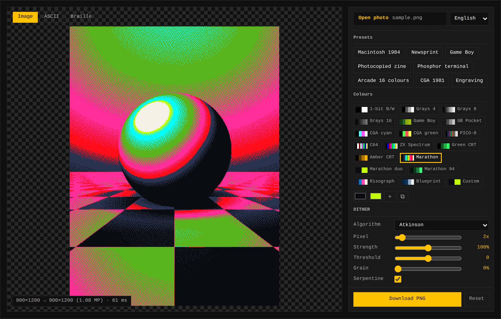

# DitherBox

Adjustable dithering for photos: the same engine in two packages.

- **A widget for your site** — plain JavaScript, no dependencies, no bundler
  required. It works in Astro exactly as it does in a hand-written HTML page.
  The image never leaves the browser: everything happens on a canvas.
- **A terminal app** with a full-screen interface in the style of
  [cliamp](https://github.com/bjarneo/cliamp): boxed panels, six-colour themes,
  sliders where the equaliser would be, the preview drawn inside the terminal.

Nineteen dithering algorithms, eighteen palettes (from one-bit black and white
to the Game Boy, from CGA to the C64 to the colours of Marathon) plus any you
write yourself, tone adjustments, megapixel control over the output, and eight
ready-made presets. The interface speaks English, Italian, Spanish, French and
German.


---

## The web widget



### Astro

```sh
npm install ditherbox
```

Copy `examples/astro/DitherBox.astro` into `src/components/` and use it:

```astro
---
import DitherBox from '../components/DitherBox.astro';
---

<DitherBox palette="bw" algorithm="atkinson" contrast={15} sharpen={40} />
```

The module can also be imported in the frontmatter without breaking the build:
it does not touch the DOM at import time, so server-side rendering goes through
cleanly.

### Plain HTML

One stylesheet, one script, one div:

```html
<link rel="stylesheet" href="dist/ditherbox.css">
<div id="dither"></div>
<script src="dist/ditherbox.global.js"></script>
<script>
  new DitherBox('#dither', {
    options: { palette: 'gameboy', algorithm: 'bayer4', scale: 4 },
  });
</script>
```

Or without writing anything at all, letting the HTML say what to do:

```html
<div data-ditherbox data-palette="gameboy" data-scale="4"></div>
<script>DitherBox.autoInit();</script>
```

Open `examples/index.html` to see both forms at work.

### What the widget does

The **Open photo** field sits at the top of the panel and the buttons at the
bottom: those two bands stay put, and only the parameters in between scroll.
Besides the field, drag and drop works, so does pasting from the clipboard,
and — on a phone — the *Shoot* button, which opens the camera directly. EXIF
orientation is respected, so portrait photos don't arrive lying down.

The preview goes through **the same megapixel reduction** as the final result:
pick 0.05 MP and you see it as coarse as it will really come out, instead of
finding out after downloading the file. The status line always says from what
to what: `3024×4032 → 1224×1632 (2.00 MP)`.

The widget carries a style reset scoped to itself, so the host site's rules
(`section { margin-bottom: 2rem }` and friends) can't pull its layout apart.

### Text art

Above the preview there are three views: **Image**, **ASCII** and **Braille**.
The last two turn the photo into characters you can select, and the **Copy**
button puts the whole block on the clipboard in one go — no dragging across the
interface. A **Columns** slider decides how wide the art is.

The two modes work differently on purpose. ASCII is *not* dithered: its
thirteen-step ramp of characters already carries the tone, and quantising to
one bit first would leave rows of solid blocks. Braille *is* dithered: a dot is
either on or off, so the gradation has to come from dot density.

```js
box.setView('ascii');       // 'image' | 'ascii' | 'braille'
const testo = box.toText(); // the same string the Copy button copies
await box.copyText();
```

### API

```js
import { DitherBox, ditherToCanvas, autoInit } from 'ditherbox/web';
import { processImage, applyPreset, PALETTES } from 'ditherbox';

const box = new DitherBox('#dither', {
  options: { palette: 'bw', algorithm: 'atkinson', megapixels: 2 },
  previewMaxSize: 900,   // longest side of the interactive preview
  presets: true,         // preset bar
  src: '/photo.jpg',     // image to load at startup
  lang: 'it',            // en | it | es | fr | de (default: the browser's)
  theme: 'dark',         // force a colour scheme
});

await box.load(file);            // File, Blob or URL
box.set({ contrast: 30 });       // update and redraw
box.getOptions();
box.reset();
box.setLocale('de');             // switch language on the fly
const canvas = box.renderFull(); // at full resolution
const blob = await box.toBlob();
await box.download('my-photo.png');
box.on('load' | 'change' | 'error', fn);
box.destroy();

// Without an interface:
const canvas = ditherToCanvas(document.querySelector('img'), { palette: 'gameboy' });
```

### Matching it to your site

The stock colours are the ones from alessandrosimonitto.it: near-black
background, white text, amber accent, sharp corners.

To match another site you only need **three values**: panel, borders and muted
text are derived from these by mixing.

```css
.dbx {
  --dbx-bg: #12100e;
  --dbx-fg: #f2ece2;
  --dbx-accent: #e8a33d;
}
```

Everything else can still be overridden if the derived value doesn't convince
you: `--dbx-panel`, `--dbx-border`, `--dbx-muted`, `--dbx-accent-fg` (which
follows `--dbx-bg` by default), `--dbx-radius` and `--dbx-radius-small` (which
follows the first), `--dbx-font`, `--dbx-panel-width`, `--dbx-height`.

If your site already exposes its own variables, hook them up and the widget
will follow every future change to the palette by itself:

```css
.dbx {
  --dbx-bg: var(--color-bg-card);
  --dbx-fg: var(--color-text);
  --dbx-accent: var(--color-accent);
  --dbx-font: var(--font-body);
}
```

### Light and dark

By default the widget follows the system preference. On a site that lives in a
single scheme that's wrong: someone with their system set to light would get a
light box in the middle of a black page. Force it:

```astro
<DitherBox theme="dark" />
```

```html
<div data-ditherbox data-theme="dark"></div>
```

```js
new DitherBox('#dither', { theme: 'dark' });
```

`data-theme` beats the system preference in both directions.

### Language

The widget picks the language from the browser and falls back to English. There
is a selector in the top-right corner of the panel, and the choice can also be
set from outside:

```astro
<DitherBox lang="it" />
```

```html
<div data-ditherbox data-lang="fr"></div>
```

```js
new DitherBox('#dither', { lang: 'de' });
box.setLocale('es');
```

---

## The terminal app

```sh
npm install -g ditherbox    # or: npx ditherbox
```

```sh
ditherbox ~/Photos                   # browse a folder
ditherbox portrait.jpg               # open a photo directly
ditherbox photo.jpg --print          # print in the terminal and exit
```

### Keys

They follow cliamp's, so if you already use that one you're at home.

| Key | What it does |
|---|---|
| `↑` `↓` / `j` `k` | Scroll the parameters or the files |
| `←` `→` / `h` `l` | Adjust the selected value |
| `H` `L` / `shift+← →` | Adjust in steps of five |
| `enter` `space` | Load the file, flip the switch |
| `tab` | Move focus between controls and file list |
| `n` `N` | Next / previous image |
| `g` `G` `home` `end` | Jump to the top / bottom |
| `v` | Change preview mode |
| `t` | Pick the theme (live preview while you scroll) |
| `p` | Apply a preset |
| `ctrl+l` | Pick the language (live preview while you scroll) |
| `i` | Invert |
| `r` | Reset every parameter |
| `o` | Open a path |
| `s` / `ctrl+s` | Save at full resolution |
| `ctrl+x` | Show or hide the file list |
| `?` / `ctrl+k` | List of keys |
| `q` / `ctrl+c` | Quit |

### The four preview modes

A terminal has no pixels, it has characters, and a cell is twice as tall as it
is wide. Each mode uses the character differently:

| Mode | Pixels per cell | When it helps |
|---|---|---|
| `halfblock` | 1×2 | **Default.** Faithful in colour and safe in any font |
| `braille` | 2×4 | The most detailed, but see the note below |
| `quadrant` | 2×2 | A middle ground, two colours per cell |
| `ascii` | 1×1 | The most nostalgic |

The default is `halfblock` and not `braille` for a practical reason: `▀` is a
block, exactly one cell wide in any font. Braille glyphs, on the other hand,
are missing from plenty of monospaced fonts; the terminal falls back to another
font with a different advance, the columns drift apart and the frame looks
broken. If your font handles braille, press `v`: the detail more than doubles
(the screenshot at the top of this page is braille).

The preview is dithered **directly at the terminal's resolution**, not shrunk
afterwards: dither large and then reduce, and averaging the pixels closes the
dots back into greys and the texture disappears. What you see is real
dithering, not a blurred photo.

All the space goes to the image: there's a single line at the top, the preview
panel hugs the photo instead of staying as wide as the screen, and the file
list only appears when there really is more than one image to choose from.

### The status line

Normally it reports the file, the processing chain and the sizes. While an
operation is running it becomes that operation's progress bar:

```
⠹ Processing at full resolution      ▰▰▰▰▰▰▱▱▱▱▱▱▱▱▱▱▱▱▱▱▱▱   25%   1.8s
```

The bar follows the real phases of the operation — reading, processing,
writing — not an invented countdown: while a phase is working the bar stays put
where it is. On a narrow terminal the line drops the least important
information instead of truncating the file name.

### Without an interface

```sh
ditherbox photo.jpg -p macintosh -o out.png
ditherbox photo.jpg --palette gameboy --scale 4 --contrast 20 -o gb.png
ditherbox photo.jpg --palette "#0a0c10,#c2fe0b" --megapixels 0.3 -o poster.png
ditherbox ~/Photos --preset fanzine --out-dir ./results
ditherbox --list                      # palettes, algorithms, presets, themes
ditherbox --help
```

Every engine parameter has its own option: `--palette`, `--algorithm`,
`--scale`, `--strength`, `--bias`, `--noise`, `--serpentine`, `--brightness`,
`--contrast`, `--gamma`, `--saturation`, `--sharpen`, `--invert`,
`--megapixels`, `--upscale`. Switches are turned off by prefixing `--no-`.

`-l, --lang <code>` picks the language of the messages; without it the CLI
reads `LC_ALL`, `LC_MESSAGES` and `LANG`, and falls back to English. The option
table in `--help` stays in English, because the options themselves are English,
but the parameter labels, the `--list` headings and every error message follow
the choice.

### Configuration

`~/.config/ditherbox/config.toml`:

```toml
theme = "gruvbox"
mode = "braille"
lang = "it"
palette = "bw"
algorithm = "atkinson"
contrast = 15
megapixels = 2
```

Personal themes go in `~/.config/ditherbox/themes/*.toml` and use the same
six-colour schema as cliamp, so a theme written for that one works here without
changes:

```toml
bg = "#002b36"
accent = "#268bd2"
bright_fg = "#eee8d5"
fg = "#839496"
green = "#859900"
yellow = "#b58900"
red = "#dc322f"
```

Included themes: `simonitto` (the default, the same colours as the widget),
`winamp`, `gruvbox`, `dracula`, `nord`, `catppuccin`, `tokyo-night`,
`everforest`, `ember`, `matte-black`, `hackerman`, `vantablack`, `terminale`
(which inherits your terminal's own background).

---

## The parameters

| Parameter | Range | What it does |
|---|---|---|
| **Palette** | 18 palettes | The colours the result is allowed to use |
| **Algorithm** | 19 algorithms | How the dots get distributed |
| **Pixel** | 1–16 | Reduce before dithering: 1 = full detail, 8 = chunky 8-bit pixels |
| **Strength** | 0–200% | How much of the error (or of the ordered noise) is applied |
| **Threshold** | −100 → 100 | Moves the cut-off point: negative darkens, positive lightens |
| **Grain** | 0–100% | Random noise before the threshold: breaks up textures that are too regular |
| **Serpentine** | on/off | Alternating scan row by row: removes the diagonal streaks |
| **Brightness, Contrast, Gamma, Saturation** | | Tone adjustments, applied before the dithering |
| **Sharpen** | 0–200% | Unsharp mask: recovers the detail the dithering eats |
| **Invert** | on/off | Swaps light and dark |
| **Megapixels** | 0.01–24 MP | Resolution of the result: lower it to ruin the photo on purpose |
| **Upscale** | on/off | Brings the result back to the original size with crisp pixels |

### Algorithms

**Error diffusion** — each pixel's error is spread over its neighbours.
Irregular texture, very faithful tone: `floydSteinberg`,
`falseFloydSteinberg`, `atkinson`, `jarvis`, `stucki`, `burkes`, `sierra`,
`sierra2`, `sierraLite`, `stevensonArce`.

`atkinson` is the 1984 Macintosh one: it diffuses only six eighths of the
error, and that's where the marked contrast that makes it recognisable comes
from.

**Ordered matrix** — each pixel is compared against a threshold that depends on
its position. Regular texture, old-video-game air: `bayer2`, `bayer4`,
`bayer8`, `bayer16`, `cluster4`, `cluster8` (magazine halftone), `lines4`
(engraving).

**No texture** — `none` (hard threshold) and `random` (pure noise).

### Palettes

`bw` (one bit), `gray4` `gray8` `gray16`, `gameboy`, `gameboyPocket`,
`cgaCyan`, `cgaGreen`, `pico8`, `c64`, `zx`, `greenCrt`, `amberCrt`,
`marathon`, `marathonDuo`, `marathonTerm`, `risograph`, `blueprint`.

`marathon` takes the colours of the 2025 game: hyper-saturated pinks and
yellows over cold steel blues and deep blacks. It is treated as a **luminance
ramp**, not as a colour palette — and that is the difference between the flat
block of colour the game actually uses and a snowfall of confetti.
`marathonDuo` keeps only black and acid yellow, for the poster cut;
`marathonTerm` is the green terminals of the 1994 Marathon.

The same goes for every tonal ramp (black and white, greys, Game Boy,
phosphor, blueprint): they are mapped on **luminance** and not on the nearest
RGB colour. It's the only way for a saturated red to land on the dark step
instead of the light green that happens to sit next to it in colour space.

### Custom palettes

A comma-separated list of hex colours works anywhere a palette name can be
written — in the widget, on the command line, in `config.toml`, in a `data-`
attribute:

```sh
ditherbox photo.jpg --palette "#0a0c10,#c2fe0b" -o poster.png
```

```html
<div data-ditherbox data-palette="#1a1423,#f2e9e4,#c9ada7"></div>
```

```js
processImage(imageData, { palette: '#1a1423,#f2e9e4' });
processImage(imageData, { palette: ['#1a1423', '#f2e9e4'] });   // this too
```

The widget has an editor: the **Custom** entry opens a row of colour pickers,
with `+` to add more and `⧉` to start from the colours of the palette you have
selected and then adjust them.

With only two tints the result is a duotone: the light and the dark of the
photo land on the two chosen colours, with the dithering making the midtones.

### Presets

`macintosh` (Mac 1984), `giornale` (print halftone), `gameboy`,
`fanzine` (high-contrast photocopy), `terminale` (green phosphor),
`arcade` (16 colours), `cga` (1981), `incisione` (engraving).

---

## The engine on its own

Plain JavaScript, no dependencies, no reference to the DOM: it runs the same in
the browser and in Node.

```js
import { processImage, ditherImage, paletteInfo, applyPreset } from 'ditherbox';

// Images are { width, height, data: Uint8ClampedArray } in RGBA:
// exactly the shape of an ImageData, so a canvas hands one straight over.
const { image, palette, ditherWidth } = processImage(imageData, applyPreset('gameboy'));
```

Adding a parameter makes it appear **by itself** in the web widget, in the TUI
and on the command line: the schema lives in one place, `src/core/options.js`,
and all three interfaces read it from there.

### Translations

No human-readable text lives in the engine. Labels, hints and messages all come
from a translator keyed on canonical English strings:

```js
import { createTranslator, LOCALES, paramLabel } from 'ditherbox';

const t = createTranslator('de');
t('ui.download');            // 'PNG herunterladen'
paramLabel(PARAMS[0], t);    // 'Palette'
```

A key missing from a translation falls back to English; a key missing from
English is returned as-is, so a typo shows up on screen instead of vanishing
into an empty string. To add a language, add its dictionary to
`src/core/i18n.js` and its code to `LOCALES` — `test/i18n.test.js` will then
tell you which keys are missing and which labels are too long for the TUI's
label column.

---

## Development

```sh
npm install
npm test          # 108 tests
npm run build     # regenerate dist/ for use with <script>
npm run docs      # regenerate every image in this README
```

The tests cover the engine, the terminal primitives, image reading and writing,
the TUI, the command line, the translations and the bundled file. The ones in
`test/layout.test.js` really do open the widget in Chromium and check the
layout: that the two columns line up, that nothing spills out of the box, that
the open-photo field and the buttons stay put while the parameters scroll, and
that the megapixel slider really does change the size of the preview. If
Chromium isn't there they skip instead of failing the suite.

If you touch anything in `src/core/` or `src/web/`, run `npm run build` again
and commit `dist/` too: there's a test that checks the bundled file is in sync
with the sources.

```
src/core/    shared engine, no DOM and no Node
src/web/     browser widget + stylesheet
src/cli/     terminal app: TUI, themes, renderer, image I/O
scripts/     build, screenshots, the sample scene for the docs
```

### The images in this README

They are generated, not taken by hand:

```sh
npm run docs
```

`scripts/sample.js` computes the test scene — a lit sphere over a chequered
floor fading into fog. It isn't a photo, and that's deliberate: the docs need
an image with long continuous gradients (the backdrop, the shading, the fog)
*and* a regular high-frequency pattern (the chequers), because those are the
two things dithering handles differently. Any given photo doesn't guarantee
both.

`scripts/termshot.js` photographs the terminal interface. It renders the TUI's
ANSI frame in Chromium with a fixed character grid, because a page is not a
terminal: the braille glyphs of DejaVu Sans Mono are 21% wider than the
letters, and pasted in as text they knock every line that contains them out of
alignment — which is exactly what used to make the screenshot in this file look
crooked. Each run of characters declares its width in cells and braille is
squeezed into its own, so the columns stay columns.

The only dependencies are `jpeg-js` and `pngjs`, both pure JavaScript and used
only by the terminal app: nothing to compile, no native modules. The web widget
has no dependencies at all. Playwright appears among the dev dependencies and
is used only by the layout checks and the screenshot scripts.

## Licence

MIT — see [LICENSE](LICENSE). You can use it, modify it and redistribute it,
including in commercial projects; the only obligation is to keep the copyright
notice.

### Third parties

The engine and the widget have no dependencies. The terminal app has two, which
install from npm and are not bundled in here:

| Package | Licence | What it's for |
|---|---|---|
| [`jpeg-js`](https://github.com/eugeneware/jpeg-js) | BSD-3-Clause | Reads and writes JPEG in pure JavaScript |
| [`pngjs`](https://github.com/pngjs/pngjs) | MIT | Reads and writes PNG |

Among the dev dependencies there is [`playwright`](https://github.com/microsoft/playwright)
(Apache-2.0), used only by the layout checks and the screenshot scripts.

These are all permissive licences and compatible with MIT: none of them
requires whoever uses them to open their own code.
